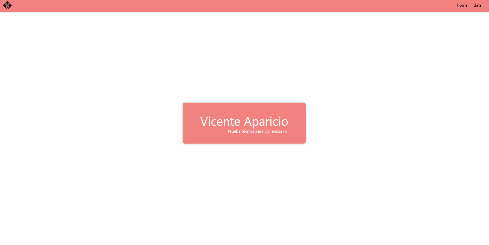
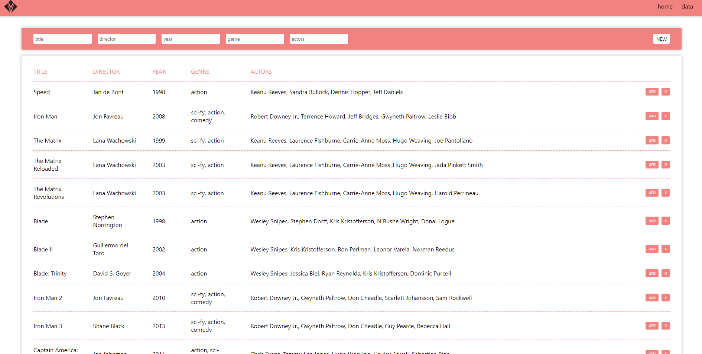
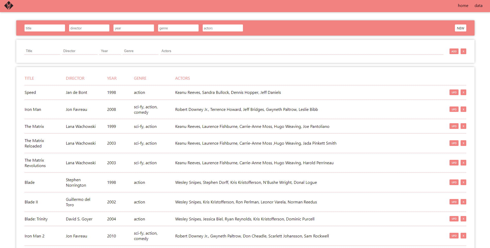
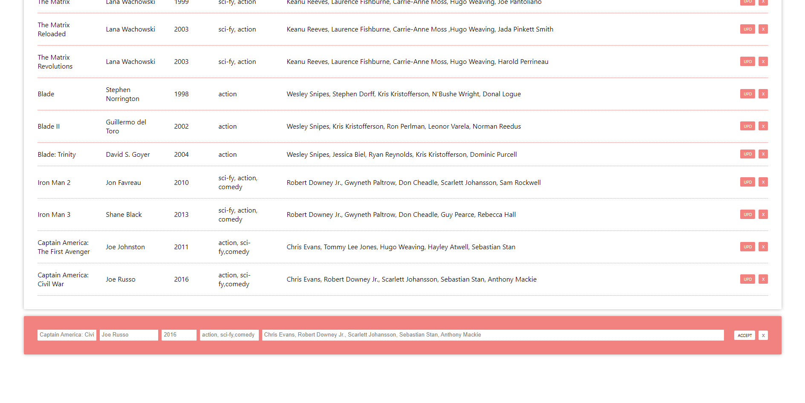

# DynamizaTic Test

Prueba técnica para DynamizaTic. 

Tiempo de trabajo: 10 horas aprox. 
Tecnologías: React Js + PHP Laravel  

### Repositorios

<a href="https://github.com/VicenteAparicio/dynamizatic">Front</a> 
<a href="https://github.com/VicenteAparicio/dynamizaback">Back</a> 
 

### Deploy

<a href="https://dynamizatestfront.herokuapp.com/">DynamizaTic Test</a>

 

## Instrucciones

Acceder al deploy en heroku a través del enlace anterior. 

  

Navegar a la sección de "data" en los links del Header. 
En esta sección encontraremos el listado de la base de datos junto con el box de los filtros.

 

A través de los inputs el usuario puede filtrar los datos sin necesidad que se recargue la página cada vez ya que el objeto ha sido guardado en un hook desde el cuál nos permitirá trabajar con él sin necesidad de volver a llamar al servidor.

 

  

En el box de los filtros encontraremos el botón para abrir la función de crear un nuevo registro.  

Esta función nos permitirá añadir los datos y decidir si los guardamos en la base de datos o cancelamos la acción.

 

 
 

En la lista de los elementos tenemos dos acciones, editar el elemento o borrarlo. Al pulsar en la acción de editar elemento nos aparecerá un box preparado con la información de ese elemento.

 

  

Desde el box de edición podremos cancelar la edición o guardarla en el servidor. 

Tanto si añadimos, eliminamos o editamos un registro el servidor nos devolverá la lista actualizada.

 
 

### ¿QUÉ HA FALTADO?

 

Me ha faltado añadir la paginación del listado. Me he quedado sin tiempo para investigar bien cómo implementarla con el método de paginate desde el backend y he decidido que no era buena idea dejarla a medias estropeando la funcionalidad del resto del código.